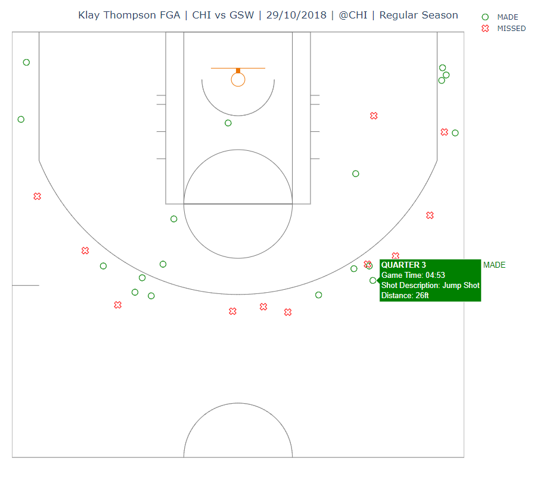
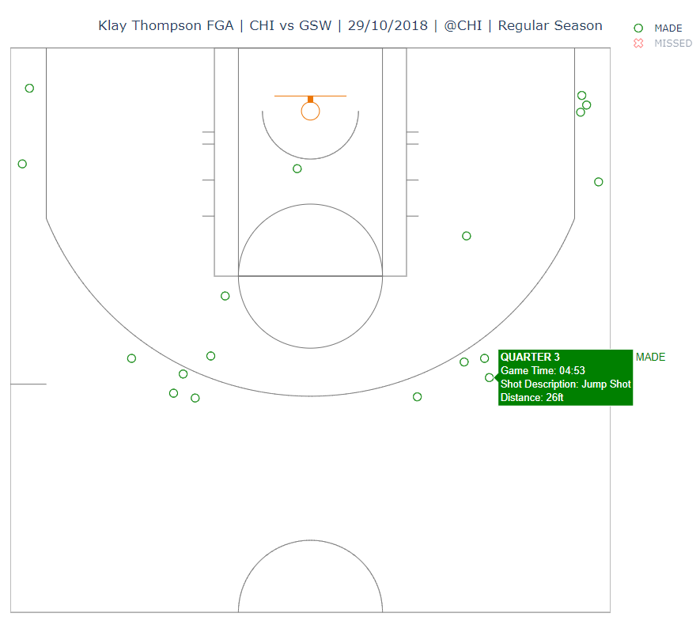

# nba_shot_charts
A program with user functionality where the user can display a shot chart of a player's shots for a specific game. The program uses the nba_api API client package (see https://github.com/swar/nba_api) to access the APIs for NBA.com. There is extensive documentation found on this repository, thank you for all of your hard work! This program also uses the basketball court plot from: https://towardsdatascience.com/interactive-basketball-data-visualizations-with-plotly-8c6916aaa59e. This project would not have been possible without these amazing resources.

The main purpose of this project was to allow me to follow games without destroying my sleep schedule. I typically use it alongside video highlights of a game to see how well a player performed.
# Features
- User can provide a player's full name, a season, a season type (playoffs/regular season) and a game date.
- A basketball court is then plotted, with all of the shots (missed/made) by the specified player in the desired game:
  
    **Shot Chart Plot Example (Klay Thompson's record-breaking game for most 3-pointers made - 14):**

- The title includes the player's name | team matchup | game date | home team | season type.
- Each point on the plot has hovertext which includes the metrics:
    - Quarter (1 - 4)
    - Game Time (12:00 - 0:00, each quarter starts at 12:00)
    - Shot Description (type of shot attempted by the player)
    - Distance (how far from the hoop the player was)


- The user can click a marker in the legend to hide a type of shot:

    **Shots Made Example (from same plot above):**
# Requirements
- Python 3.8 (or newer)
- Libraries: 
  - nba_api
  - plotly
  - pandas
  - numpy
  
# Installation
### Python 3.8
- See https://www.codecademy.com/article/install-python for python 3.8 installation instructions.

### Libraries
- Once Python has been installed, run the command prompt (cmd) and enter:
```
python -m pip install nba_api

python -m pip install plotly

python -m pip install pandas

python -m pip install numpy (may already be installed during Python/pandas installation)
```
# Usage
## Running the program
1. Access the directory of the nba_shot_charts file through the command prompt:
```
cd [File Path]
```
2. Then enter:
```
python main.py
```
3. The program will prompt the user for their input at different stages. Instructions are provided within the program to ensure that the user enters the correct input (see examples in brackets when the program is running).

## Exiting the program
You can exit the program by inputting 'N' when prompted at the end of a visualisation. (See limitations)

# Components
See the relevant files for more detailed annotations. My project is made up of these parts:

- main.py - Executable code to run the app is located here.
- seasons.py - List of all available seasons. (See limitations)
- error_handling.py - Module containing functions which verifies that the user input is in the correct format when executing API calls.
- shot_chart_functions.py - Module containing functions which handle processing the data and creating the visualisation.

# Bug
- If a player has played some minutes and doesn't score (e.g garbage time or the player has a terrible game), then the program gets stuck when the user has to provide a game date; the validation check for the game date passes (i.e correctly formatted date for the API call) but there is no data returned as the player did not score so this input cannot be exited until the user provides a game where the player scored at least one point; or they can break the program - User must type: ***CTRL* + *Z*** (on Windows) to break the program and is then able to restart it (see **Usage 2.**).
# Limitations
- The NBA only started collecting play-by-play data in the 1996-97 season, so there is no shot co-ordinates data existing before then.
- If a player has a propensity to go for dunks or attempts shots in a very similar area, the points plotted on the shot chart will overlap. This is more a limitation of shot charts themselves as opposed to an issue in unique to this program.
- If a player attempts a shot from beyond the half-court mark (e.g. player shooting a buzzer beater from their half), that shot will not be displayed on the plot.
- The user has to convert the game date in the **AVAILABLE GAMES** df to a different format when inputting their desired game date (e.g: OCT 29, 2018 -> 20181029).
- Users less familiar with the NBA may have issues thinking about when a season began and what season type the game took place in. These need to be known before the user enters their inputs.

    **3 games taking place in the same calendar year but with different seasons and season_types:**
  -  e.g: APR 10, 2019 - season: **2018-19**, season type: **Regular Season**
  -  e.g: APR 13, 2019 - season: **2018-19**, season type: **Playoffs**
  -  e.g: OCT 24, 2019 - season: **2019-20**, season type: **Regular Season**
  
**Features to be added**
- Fix the Bug.
- Will need to add a feature which allows the user to exit the program at any point instead of only after the visualisation.
- Display all games for when the df is too large for regular season games - compresses df in the terminal currently. The maximum number of games a player can play in a given time frame (across the whole Regular Season) is 82.
- Standardize the game date format across the whole program.
- Total PTS, FGM/FGA, FG3M/FG3A, FTM/FTA annotated on the graph.